# Agentic Workflow Project

End-to-end pipeline for ACEA automotive data (https://www.acea.auto/nav/?content=press-releases+publications&tag=registrations-of-vehicles):

Inspired by recent client work at a capital management firm.

1. scrape monthly PDFs,
2. parse to schema-aligned CSV,
3. load to Snowflake,
4. transform with dbt,
5. publish to Tableau,
6. triage with Tableau MCP and generate analysis artifacts.

## Natural Language First (Recommended)

This workflow is designed to run end-to-end through **natural language chat with AI**.

You can ask the AI to execute the entire sequence (scrape, parse, upload, dbt build, Tableau publish, and triage plotting) without manually running each script.

Example prompts:

- "Run the full ACEA pipeline end to end."
- "Refresh data, rebuild dbt, publish Tableau, then generate YTD triage plots."
- "Triage monthly YTD units sold per manufacturer and save outputs to analyses."

Use the command-based runbook below when you want manual control or debugging.

## Quickstart (CLI fallback)

From repo root:

```powershell
& "./.venv/Scripts/python.exe" execution/webscrape.py
& "./.venv/Scripts/python.exe" execution/pdf_scrape.py --input PDFs --output data
& "./.venv/Scripts/python.exe" execution/upload_snowflake.py
Set-Location "dbt"; & "../.venv/Scripts/dbt.exe" build; Set-Location ".."
& "./.venv/Scripts/python.exe" execution/publish_tableau_datasource.py
```

Then run triage plotting as needed:

```powershell
& "./.venv/Scripts/python.exe" execution/plot_monthly_ytd.py --title monthly_ytd_units_sold_per_manufacturer
```

## Architecture

This repo follows a 3-layer model:

- **Directives** (`directives/`): SOP-style instructions (what to do)
- **Orchestration** (AI agent): sequencing, error handling, decision-making
- **Execution** (`execution/`): deterministic Python scripts (doing the work)

Reference: `agents.md`

### Pipeline Diagram

```mermaid
flowchart LR
	A[ACEA Website] --> B[execution/webscrape.py]
	B --> C[PDFs/ACEA]
	C --> D[execution/pdf_scrape.py]
	D --> E[data/*.csv]
	E --> F[execution/upload_snowflake.py]
	F --> G[(Snowflake ACEA_DATA)]
	G --> H[dbt: stg -> int -> marts]
	H --> I[(MARTS_ACEA_METRICS)]
	I --> J[execution/publish_tableau_datasource.py]
	J --> K[Tableau Datasource: marts_acea]
	K --> L[Tableau MCP Query Export]
	L --> M[analyses/YYYY-MM-DD/title/*.csv]
	M --> N[execution/plot_monthly_ytd.py]
	N --> O[analyses/YYYY-MM-DD/title/*.png + run_metadata.json]
```



## Function Ownership

### 1) AI build

- `execution/pdf_scrape.py`
- `execution/plot_monthly_ytd.py`
- `execution/webscrape.py`

### 2) Self built

- `execution/publish_tableau_datasource.py`
- `execution/upload_snowflake.py`
- `execution/logger.py`
- All dbt models under `dbt/models/`

## Repository Structure

- `execution/` — operational scripts (`webscrape.py`, `pdf_scrape.py`, `upload_snowflake.py`, `publish_tableau_datasource.py`, `plot_monthly_ytd.py`)
- `directives/` — workflow SOPs (currently `pdf_scrape.md`)
- `dbt/` — dbt project (`stg`, `int`, `marts`)
- `schema/` — schema definitions by source (for example `ACEA.csv`)
- `PDFs/` — downloaded PDFs
- `data/` — intermediate CSVs
- `analyses/` — triage outputs and plots
- `.vscode/mcp.json` — MCP server config
- `.vscode/.env` — local MCP secrets/config (including Tableau PAT)

## Prerequisites

- Windows + PowerShell
- Python virtual environment in `.venv`
- Node.js (required only for `tableau-mcp/`)
- dbt Core in project `.venv` (required)
- dbt MCP server runtime (`uvx` in `.venv/Scripts/uvx.exe`, configured in `.vscode/mcp.json`)
- Snowflake credentials in root `.env`
- Tableau credentials for publishing in root `.env`
- Tableau MCP credentials in `.vscode/.env`

### dbt Core vs Fusion

- This project is designed to run with **dbt Core CLI** from `.venv`.
- For Python model execution, prefer Core CLI (`../.venv/Scripts/dbt.exe`) over Fusion CLI in this repo.
- dbt MCP is used for AI-driven dbt operations (for example codegen/docs/lineage workflows), while Core CLI remains the reliable execution path for builds in this project.

## Environment Configuration

### 1) Root `.env` (Python scripts)

Populate the following keys in `.env`:

- `snowflake_user`
- `snowflake_password`
- `snowflake_account`
- `snowflake_schema`
- `snowflake_database`
- `tableau_user`
- `tableau_password`
- `tableau_server`
- `tableau_site`

### 2) VS Code MCP `.vscode/.env` (Tableau MCP)

Populate:

- `TRANSPORT`
- `SERVER`
- `SITE_NAME`
- `PAT_NAME`
- `PAT_VALUE`
- `DEFAULT_LOG_LEVEL`

`PAT_VALUE` is kept outside `mcp.json` in this file.

## Setup

Install Python dependencies:

```powershell
& "./.venv/Scripts/python.exe" -m pip install -r requirements.txt
```

Build Tableau MCP (from repo root):

```powershell
Set-Location "tableau-mcp"
npm install
npm run build
Set-Location ".."
```

Verify dbt Core + dbt MCP prerequisites:

```powershell
& "./.venv/Scripts/dbt.exe" --version
& "./.venv/Scripts/uvx.exe" --version
```

## End-to-End Runbook

From repo root:

### 1) Download ACEA PDFs

```powershell
& "./.venv/Scripts/python.exe" execution/webscrape.py
```

### 2) Parse PDFs to CSV

```powershell
& "./.venv/Scripts/python.exe" execution/pdf_scrape.py --input PDFs --output data
```

### 3) Upload to Snowflake

```powershell
& "./.venv/Scripts/python.exe" execution/upload_snowflake.py
```

### 4) Build dbt models

```powershell
Set-Location "dbt"
& "../.venv/Scripts/dbt.exe" build
Set-Location ".."
```

Key models:

- `stg_acea_data` (view)
  - Renames and standardizes raw source columns from `acea_data`.
  - Keeps the original `pdf` as `pdf_name` so downstream models can identify duplicate records from overlapping PDF releases.

- `int_acea_data` (view)
  - Performs **deduplication at business grain**: `region, manufacturer, frequency, month`.
  - Uses `row_number()` partitioned by that grain and ordered by `pdf_name desc`.
  - Keeps only `row_number = 1`, meaning the latest PDF version wins when multiple rows exist for the same business key.
  - Adds a stable surrogate key `id` using `dbt_utils.generate_surrogate_key([manufacturer, month, frequency, region])`.

- `marts_acea_metrics` (table, Python model)
  - Reads `int_acea_data` into pandas and converts `MONTH` (`Mon-YY`) into month-end `DATE`.
  - Removes source `YTD` rows, then re-derives metrics consistently.
  - Resamples monthly per `MANUFACTURER/FREQUENCY/REGION` with forward-fill for continuity.
  - Computes:
    - `YTD` as cumulative sum within each year and cut
    - `TTM` as 12-month rolling sum
    - `*_PoP` as period-over-period pct change
    - `*_YoY` as year-over-year pct change (12 periods for monthly, 4 for quarterly)
  - Melts wide metrics into long format: dimensions + `Measure` / `Value` for Tableau-friendly analysis.

### 5) Publish Tableau datasource

```powershell
& "./.venv/Scripts/python.exe" execution/publish_tableau_datasource.py
```

## Data Triage Workflow

Directive source: `directives/pdf_scrape.md` (Step 6).

**Visualization standard:** Data visualization is driven by the `data-viz-plots` skill so plots keep a consistent theme, styling, and output quality across triage runs.

### 6a) Query + export dataset

Use Tableau MCP query tools to retrieve analysis data, then save CSV into an analysis run folder.

### 6b) Plot artifacts

Generate charts from exported CSV using the skill-driven plotting workflow (consistent theme and styling using data_viz_plots skill):

```powershell
& "./.venv/Scripts/python.exe" execution/plot_monthly_ytd.py --title monthly_ytd_units_sold_per_manufacturer
```

## Analysis Output Convention

Each triage request must write to:

`analyses/<YYYY-MM-DD>/<title>/`

Rules:

- Date has no timestamp
- Title is a concise summary of the request
- If folder exists, append suffix (for example `_2`)
- Keep run artifacts together (CSV, PNG, metadata JSON)

Example artifacts:

- `monthly_ytd_units_sold_per_manufacturer.csv`
- `monthly_ytd_units_all_manufacturers.png`
- `monthly_ytd_units_top12_manufacturers.png`
- `run_metadata.json`

## Logging

- Central logger: `execution/logger.py`
- Runtime log file: `python.log`

## Notes and Gotchas

- Use dbt Core CLI from project `.venv` for Python model support.
- dbt MCP does not replace dbt execution; keep using Core CLI for `dbt build` in this repository.
- After MCP config edits, reload VS Code window to ensure MCP restarts with new environment.

## Useful Commands

Re-run only marts model:

```powershell
Set-Location "dbt"
& "../.venv/Scripts/dbt.exe" build -s marts_acea_metrics
Set-Location ".."
```

Run plotting with custom top N:

```powershell
& "./.venv/Scripts/python.exe" execution/plot_monthly_ytd.py --title monthly_ytd_review --top-n 15
```
