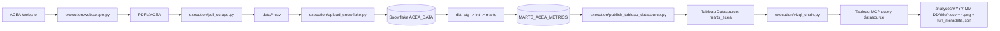

# Agentic Workflow Project

End-to-end pipeline for ACEA automotive data (https://www.acea.auto/nav/?content=press-releases+publications&tag=registrations-of-vehicles):

Inspired by recent client work at a capital management firm.

1. scrape monthly PDFs,
2. parse to schema-aligned CSV,
3. load to Snowflake,
4. transform with dbt,
5. publish to Tableau,
6. triage with Tableau MCP and generate analysis artifacts.

## Natural Language First (Recommended)

This workflow is designed to run end-to-end through \*\*natural language chThe agent (`execution/agent.py`) is a LangChain/LangGraph ReAct loop that wraps each pipeline step as a structured tool. It handles sequencing, error handling, and data triage automatically.

```powershell
& "./.venv/Scripts/python.exe" -m execution.agent "Run the full ACEA pipeline end to end."
```

Example prompts:

- "Run the full ACEA pipeline end to end."
- "Refresh data, rebuild dbt, publish Tableau, then generate YTD triage plots."
- "Show me top 10 manufacturers in the EU by units sold."
- "Show me YTD period-over-period by region and save a bar chart."

Use the command-based runbook below when you want manual control or debugging.

## Quickstart (CLI fallback)

From repo root:

```powershell
& "./.venv/Scripts/python.exe" execution/webscrape.py
& "./.venv/Scripts/python.exe" execution/pdf_scrape.py --input PDFs --output data
& "./.venv/Scripts/python.exe" execution/upload_snowflake.py
Set-Location "dbt"; & "../.venv/Scripts/dbt.exe" build; Set-Location ".."
& "./.venv/Scripts/python.exe" execution/publish_tableau_datasource.py
```

## Architecture

This repo follows a 3-layer model:

- **Directives** (`directives/`): SOP-style instructions (what to do)
- **Orchestration** (`execution/agent.py`): LangChain/LangGraph ReAct agent — sequencing, error handling, decision-making
- **Execution** (`execution/`): deterministic Python scripts (doing the work)

Reference: `agents.md`

### Pipeline Diagram


```mermaid
flowchart LR
	A[ACEA Website] --> B[execution/webscrape.py]
	B --> C[PDFs/ACEA]
	C --> D[execution/pdf_scrape.py]
	D --> E[data/*.csv]
	E --> F[execution/upload_snowflake.py]
	F --> G[(Snowflake ACEA_DATA)]
	G --> H[dbt: stg -> int -> marts]
	H --> I[(MARTS_ACEA_METRICS)]
	I --> J[execution/publish_tableau_datasource.py]
	J --> K[Tableau Datasource: marts_acea]
	K --> L[execution/vizql_chain.py]
	L --> M[Tableau MCP query-datasource]
	M --> N[analyses/YYYY-MM-DD/title/*.csv + *.png + run_metadata.json]
```

## Agent Tools

The agent exposes the following tools to the LLM:

| Tool                       | Purpose                                                                       |
| -------------------------- | ----------------------------------------------------------------------------- |
| `run_webscrape`            | Download ACEA PDFs                                                            |
| `run_pdf_scrape`           | Parse PDFs to schema-aligned CSVs                                             |
| `verify_csvs`              | Preview data/ CSVs before upload                                              |
| `run_upload_snowflake`     | Upload CSVs to Snowflake                                                      |
| `run_dbt_build`            | Run `dbt build`                                                               |
| `run_publish_tableau`      | Publish Hyper extract to Tableau Server                                       |
| `construct_vizql_query`    | Translate NL question → VizQL query via Claude Haiku + live datasource schema |
| `create_analysis_folder`   | Create `analyses/<date>/<title>/` run folder                                  |
| `save_query_csv`           | Save query result rows as CSV                                                 |
| `generate_plot`            | Generate matplotlib PNG from CSV                                              |
| `save_run_metadata`        | Save run metadata JSON                                                        |
| `query-datasource` _(MCP)_ | Execute VizQL query against Tableau datasource                                |

### VizQL Query Chain

`construct_vizql_query` calls `execution/vizql_chain.py`, which:

1. Signs in to Tableau Server and resolves the datasource LUID
2. Reads live field metadata and distinct dimension values
3. Fetches the `query-datasource` tool JSON schema from the Tableau MCP server
4. Passes all context to **Claude Haiku** to translate the NL question into a valid VizQL query
5. Returns the structured query for the agent to pass to `query-datasource`

## Function Ownership

### 1) AI build

- `execution/pdf_scrape.py`
- `execution/pdf_extract_chain.py`
- `execution/webscrape.py`
- `execution/mcp_utils.py`

### 2) Self built

- `execution/publish_tableau_datasource.py`
- `execution/upload_snowflake.py`
- `execution/logger.py`
- `execution/vizql_chain.py`
- `execution/agent.py`
- All dbt models under `dbt/models/`

## Repository Structure

- `execution/` — operational scripts and agent
  - `agent.py` — LangChain/LangGraph ReAct agent orchestrator
  - `vizql_chain.py` — NL → VizQL query chain (Haiku + live schema)
  - `mcp_utils.py` — Tableau MCP session management
  - `pdf_extract_chain.py` — LLM-powered PDF row extraction
  - `webscrape.py`, `pdf_scrape.py`, `upload_snowflake.py`, `publish_tableau_datasource.py`, `logger.py`
- `directives/` — workflow SOPs (currently `pdf_scrape.md`)
- `dbt/` — dbt project (`stg`, `int`, `marts`)
- `schema/` — schema definitions by source (for example `ACEA.csv`)
- `PDFs/` — downloaded PDFs
- `data/` — intermediate CSVs
- `analyses/` — triage outputs (CSV, PNG, run_metadata.json)
- `tableau-mcp/` — Tableau MCP server (Node.js)
- `.vscode/start-tableau-mcp.ps1` — MCP server launcher
- `.vscode/.env` — local MCP secrets/config (including Tableau PAT)

## Prerequisites

- Windows + PowerShell
- Python virtual environment in `.venv`
- Node.js (required for `tableau-mcp/`)
- dbt Core in project `.venv` (required)
- Snowflake credentials in root `.env`
- Tableau credentials for publishing in root `.env`
- Tableau MCP credentials in `.vscode/.env`

### dbt Core vs Fusion

- This project is designed to run with **dbt Core CLI** from `.venv`.
- For Python model execution, prefer Core CLI (`../.venv/Scripts/dbt.exe`) over Fusion CLI in this repo.

## Environment Configuration

### 1) Root `.env` (Python scripts + agent)

Populate the following keys in `.env`:

- `snowflake_user`
- `snowflake_password`
- `snowflake_account`
- `snowflake_schema`
- `snowflake_database`
- `tableau_user`
- `tableau_password`
- `tableau_server`
- `tableau_site`
- `ANTHROPIC_API_KEY`

### 2) VS Code MCP `.vscode/.env` (Tableau MCP server)

Populate:

- `TRANSPORT`
- `SERVER`
- `SITE_NAME`
- `PAT_NAME`
- `PAT_VALUE`
- `DEFAULT_LOG_LEVEL`

`PAT_VALUE` is a Tableau Personal Access Token. PATs expire after ~30 days — regenerate and update this file when you see 401 errors from the MCP server.

## Setup

Install Python dependencies:

```powershell
& "./.venv/Scripts/python.exe" -m pip install -r requirements.txt
```

Build Tableau MCP (from repo root):

```powershell
Set-Location "tableau-mcp"
npm install
npm run build
Set-Location ".."
```

Verify dbt Core:

```powershell
& "./.venv/Scripts/dbt.exe" --version
```

## End-to-End Runbook

From repo root:

### 1) Download ACEA PDFs

```powershell
& "./.venv/Scripts/python.exe" execution/webscrape.py
```

### 2) Parse PDFs to CSV

```powershell
& "./.venv/Scripts/python.exe" execution/pdf_scrape.py --input PDFs --output data
```

### 3) Upload to Snowflake

```powershell
& "./.venv/Scripts/python.exe" execution/upload_snowflake.py
```

### 4) Build dbt models

```powershell
Set-Location "dbt"
& "../.venv/Scripts/dbt.exe" build
Set-Location ".."
```

Key models:

- `stg_acea_data` (view)
  - Renames and standardizes raw source columns from `acea_data`.
  - Keeps the original `pdf` as `pdf_name` so downstream models can identify duplicate records from overlapping PDF releases.

- `int_acea_data` (view)
  - Performs **deduplication at business grain**: `region, manufacturer, frequency, month`.
  - Uses `row_number()` partitioned by that grain and ordered by `pdf_name desc`.
  - Keeps only `row_number = 1`, meaning the latest PDF version wins when multiple rows exist for the same business key.
  - Adds a stable surrogate key `id` using `dbt_utils.generate_surrogate_key([manufacturer, month, frequency, region])`.

- `marts_acea_metrics` (table, Python model)
  - Reads `int_acea_data` into pandas and converts `MONTH` (`Mon-YY`) into month-end `DATE`.
  - Removes source `YTD` rows, then re-derives metrics consistently.
  - Resamples monthly per `MANUFACTURER/FREQUENCY/REGION` with forward-fill for continuity.
  - Computes:
    - `YTD` as cumulative sum within each year and cut
    - `TTM` as 12-month rolling sum
    - `*_PoP` as period-over-period pct change
    - `*_YoY` as year-over-year pct change (12 periods for monthly, 4 for quarterly)
  - Melts wide metrics into long format: dimensions + `Measure` / `Value` for Tableau-friendly analysis.

### 5) Publish Tableau datasource

```powershell
& "./.venv/Scripts/python.exe" execution/publish_tableau_datasource.py
```

### 6) Data triage (via agent)

```powershell
& "./.venv/Scripts/python.exe" -m execution.agent "Show me top 10 manufacturers in the EU by units sold and save a bar chart."
```

The agent queries the Tableau datasource via MCP, saves the CSV, generates a PNG, and writes `run_metadata.json` — all into `analyses/<date>/<title>/`.

## Data Model

The published `marts_acea` datasource uses an EAV (long) format:

| Field          | Type     | Notes                                                                                       |
| -------------- | -------- | ------------------------------------------------------------------------------------------- |
| `DATE`         | DATETIME | Month-end date                                                                              |
| `MANUFACTURER` | STRING   | e.g. `Volkswagen`                                                                           |
| `REGION`       | STRING   | e.g. `European Union (EU)`                                                                  |
| `FREQUENCY`    | STRING   | `Monthly` or `Quarterly`                                                                    |
| `Measure`      | STRING   | `UNITS`, `YTD`, `YTD_PoP`, `TTM`, `TTM_PoP`, `TTM_YoY`, `UNITS_PoP`, `UNITS_YoY`, `YTD_YoY` |
| `Value`        | REAL     | Numeric value for the measure                                                               |

All VizQL queries filter on `Measure` to select the metric type, and aggregate `Value`.

## Analysis Output Convention

Each triage request writes to:

`analyses/<YYYY-MM-DD>/<title>/`

Rules:

- Date has no timestamp
- Title is a concise summary of the request (snake_case)
- If folder exists, append suffix (for example `_2`)
- Keep run artifacts together (CSV, PNG, metadata JSON)

## Logging

- Central logger: `execution/logger.py`
- Runtime log file: `python.log`

## Notes and Gotchas

- Use dbt Core CLI from project `.venv` for Python model support.
- After MCP config edits, reload VS Code window to ensure MCP restarts with new environment.
- Tableau PATs expire after ~30 days. A 401 error from `query-datasource` means the PAT in `.vscode/.env` needs regenerating.

## Useful Commands

Re-run only marts model:

```powershell
Set-Location "dbt"
& "../.venv/Scripts/dbt.exe" build -s marts_acea_metrics
Set-Location ".."
```

Test VizQL chain in isolation:

````powershell
& "./.venv/Scripts/python.exe" -m execution.vizql_chain "Top 5 manufacturers by YTD units in EU"
run only marts model:

```powershell
Set-Location "dbt"
& "../.venv/Scripts/dbt.exe" build -s marts_acea_metrics
Set-Location ".."
````

Run plotting with custom top N:

```powershell
& "./.venv/Scripts/python.exe" execution/plot_monthly_ytd.py --title monthly_ytd_review --top-n 15
```
